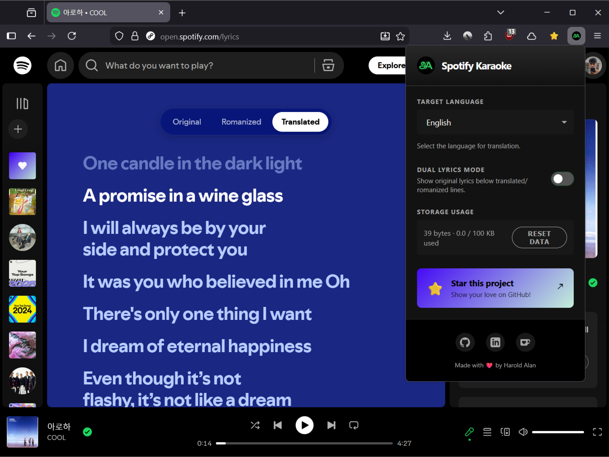
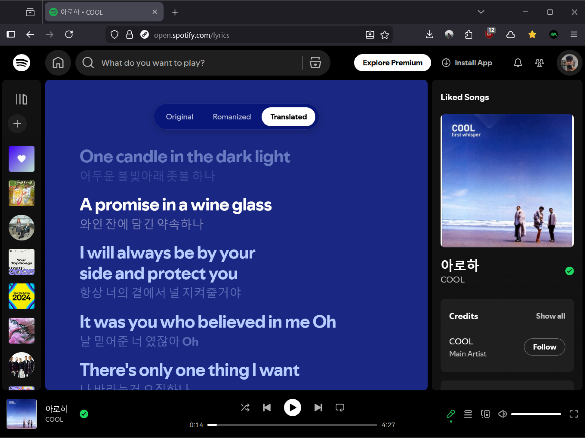
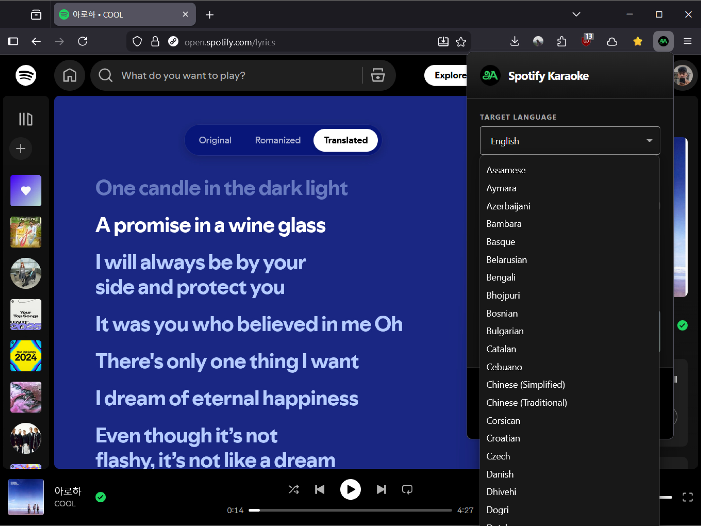
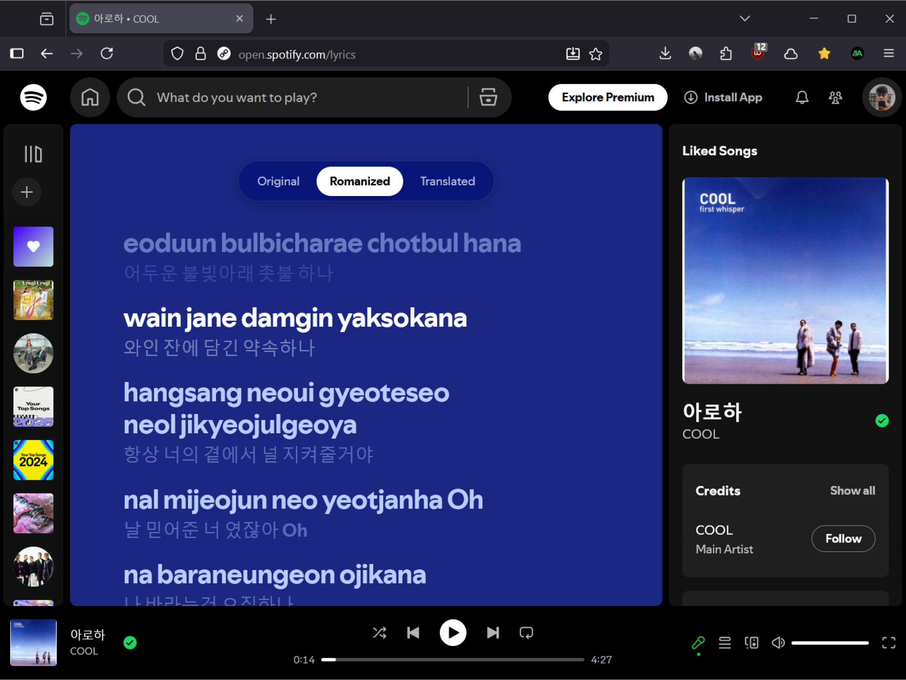

<div align="center">
  
  <h1>🎤 Spotify Karaoke</h1>
  <p><strong>A high-performance browser extension seamlessly injecting real-time translated and romanized lyrics directly into Spotify's React render tree.</strong><br>Engineered with WXT, Preact, and massive local offline translation dictionaries.</p>

  <a href="https://chromewebstore.google.com/detail/spotify-karaoke-romanize/"></a>
  <a href="https://addons.mozilla.org/es-ES/firefox/addon/spotify-karaoke/"></a>
</div>

## 🧠 Core Architecture & Technical Implementation

Spotify Karaoke isn't just a simple UI overlay; it's a sophisticated DOM manipulation engine built to withstand Spotify's complex state changes and heavy React Single Page App (SPA) architecture.

### 💉 React Tree DOM Injection
Standard CSS overlays break and flicker during Spotify's aggressive DOM recycling when the user scrolls lyrics.
Instead, we utilize a highly optimized `MutationObserver` attached directly to Spotify's `<main>` container. Our engine intercepts newly rendered lyrics, diffs them against our internal `Map` caches, and natively injects perfectly interleaved `<span>` elements directly into the existing React components. This achieves a 0ms perceived lag time and zero UI flickering during "Dual Lyrics" mode.

### 🌗 Dual Lyrics Mode
Dual Lyrics mode elegantly displays the translation or romanization as the primary line, with the original lyrics positioned directly below it.
> Dynamically injected straight into Spotify's React tree using a dedicated `MutationObserver`. **No UI flickering, just pure karaoke.**

| Dual Lyrics (ON) | Dual Lyrics (OFF) |
| :---: | :---: |
|  |  |

### 🌐 Advanced Translation Chunking Engine
Translating lyrics line-by-line triggers catastrophic API rate limits globally (`429 Too Many Requests`).
To bypass this, our background worker orchestrates a **Smart Chunking Algorithm** that:
1. Concatenates the active lyrics.
2. Formats them dynamically to preserve whitespace and sync timings.
3. Fires minimal batch payloads through Google's Translation APIs.
4. Auto-failovers to MyMemory APIs on timeout.
5. Re-hydrates the AST string back into the specific line arrays demanded by the content script.

### 📖 Translation Engine
Seamlessly translate lyrics into your preferred language (**100+ languages supported**) while preserving the original line structure.
> Powered by the **Google Translate API** (`translate.googleapis.com`), with automated failovers to the MyMemory API if rate-limited. Smart chunking ensures rigid limits are bypassed elegantly, and translated lyrics are cached per song for instant mode-switching.

| Mode Switching | 100+ Supported Languages |
| :---: | :---: |
|  |  |

### 🔤 Intelligent Romanization
Sing along to your favorite international songs! The extension detects the script of the playing lyrics on-the-fly and applies the most accurate romanization system.

| Original Script (Hangul) | Romanized Overlay |
| :---: | :---: |
|  |  |

Rather than pinging an API 3,000 times for every song just to display Japanese or Korean text, Spotify Karaoke uses `fflate` and ArrayBuffer unboxing mechanisms to securely load massive local linguistic dictionaries straight into the browser's memory—bypassing cross-origin isolation traps on Firefox.

We execute dynamic regex script detection to route the song to the most accurate bundled parser instantly:

| Language / Script | Transliteration Engine | Execution Flow |
| :--- | :--- | :--- |
| **Japanese** *(Kanji, Kana)* | [`@sglkc/kuroshiro`](https://github.com/sglkc/kuroshiro-ts) + Kuromoji | Local Dictionary Buffer ⚡ |
| **Korean** *(Hangul)* | [`@romanize/korean`](https://www.npmjs.com/package/@romanize/korean) | Local Bundle ⚡ |
| **Chinese** *(Hanzi)* | [`pinyin-pro`](https://www.npmjs.com/package/pinyin-pro) | Local AST Matcher ⚡ |
| **Indic Scripts** *(Telugu, Gujarati, Devanagari)* | [`@indic-transliteration/sanscript`](https://www.npmjs.com/package/@indic-transliteration/sanscript) | Local Mapping ⚡ |
| **Cyrillic** *(Russian, etc.)* | [`cyrillic-to-translit-js`](https://www.npmjs.com/package/cyrillic-to-translit-js) | Local Map ⚡ |
| **Thai** | [`@dehoist/romanize-thai`](https://www.npmjs.com/package/@dehoist/romanize-thai) | Local Regex ⚡ |
| **Tamil, Bengali, Arabic** | Google Translate (`dt=rm`) | Remote Batch payload ☁️ |
| *(Error Fallback)* | [`transliteration`](https://www.npmjs.com/package/transliteration) | Local ⚡ |

---

## 🚀 Installation

### Official Stores
The easiest way to get started and receive automatic updates:
* 📥 **[Chrome Web Store (Chromium, Edge, Brave, etc.)](https://chromewebstore.google.com/detail/spotify-karaoke-romanize/)**
* 📥 **[Firefox Add-ons](https://addons.mozilla.org/es-ES/firefox/addon/spotify-karaoke/)**

### Developer Mode (Manual)
1. Download the latest release from the [Releases page](../../releases).
2. Extract the archive.
3. Navigate to your browser's extensions page (`chrome://extensions` or `about:debugging`).
4. Enable **Developer Mode**.
5. Click **Load unpacked** (Chrome) or **Load Temporary Add-on** (Firefox) and select the directory.

---

## 🛠️ Developers

Built for speed and maintainability using **WXT**, **Preact**, and **TypeScript**.

### Quick Start
```bash
# 1. Clone the repository
git clone https://github.com/haroldalan/spotify-karaoke.git
cd spotify-karaoke

# 2. Install dependencies (Node v18+ required)
npm install

# 3. Start the dev server
npm run dev          # Chrome
npm run dev:firefox  # Firefox

# 4. Build for production
npm run build
```

---

## 🤝 Contributing
Contributions make the open-source community an amazing place to learn and inspire. 
1. Fork the Project
2. Create your Feature Branch (`git checkout -b feature/AmazingFeature`)
3. Commit your Changes (`git commit -m 'feat: add AmazingFeature'`)
4. Push to the Branch (`git push origin feature/AmazingFeature`)
5. Open a Pull Request

---

## 🔒 Privacy & Disclaimer

* **Privacy:** We do not track your listening habits, IP address, or any personal information. Your settings (language, mode toggles) are saved securely in your browser's synchronized storage (`storage.sync`). Translator features process lyric text temporarily through Google Translate APIs. See Google's [Privacy Policy](https://policies.google.com/privacy).
* **Disclaimer:** Spotify Karaoke is not affiliated, associated, authorized, endorsed by, or explicitly connected with Spotify AB. This extension modifies the Spotify web player for educational/accessibility purposes.

---

## 💖 Support

Spotify Karaoke is and always will be free, open-source software built for the community. If this extension improved your jams, consider buying me a coffee!

<a href="https://ko-fi.com/haroldalan"></a>

---

<div align="center">
  Distributed under the MIT License. See <code>LICENSE</code> for more information.<br>
  <i>Made with ❤️ by Harold Alan. If you love this extension, please consider starring the repository!</i>
</div>
