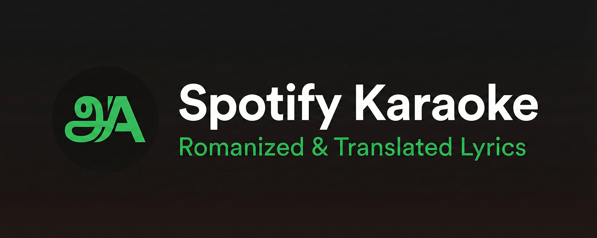

<div align="center">
  <h1>
  </h1>
  <p>Universal script romanization and real-time translation for 132 languages — right inside Spotify</p>
  
  <a href="https://chromewebstore.google.com/detail/spotify-karaoke/bhhkohameknlmcgdfafkjplpjalfedie" target="_blank"></a>
  <a href="https://addons.mozilla.org/en-US/firefox/addon/spotify-karaoke/" target="_blank"></a>
  <a href="https://microsoftedge.microsoft.com/addons/detail/spotify-karaoke-romaniz/gpaojfekocbgcofcbbcinfpnbagjakom" target="_blank"></a>
  <br><br>
  
  
</div>

---
###  Phonetic Romanization
Universal support for any script, with optimized local engines for 16 major writing systems.
*Example: `안녕하세요` → `an-nyeong-ha-se-yo`*

---

###  Real-time Translation
Read lyrics in 132 languages to understand the meaning behind every line.
*Example: `君を愛してる` → `I love you`*

---

###  Native Restoration
Bypass low-quality fallbacks and restore original, high-fidelity native scripts automatically.
*Example: `Anyonhasyo` ✨ → `안녕하세요`*

---

###  *Coming Soon* — Smart Fetch
Automatic lyrics discovery for songs that aren't officially supported by Spotify.
*Example: `Lyrics not available` 🔍 → `Synced Lyrics found`*

---

###  *Coming Soon* — Ultimate Triple View
Original, Romanized, and Translated text all in a single, perfectly synced frame.
*Example: Stacked lyrics (`君を愛してる` / `Kimi o aishiteru` / `I love you`)*

---

## Demo reel

<div align="center">
  <a href="https://www.youtube.com/watch?v=Ac-_37aJmoI">
    
  </a>
</div>

---

## What it does

Spotify's built-in lyrics panel doesn't help you sing along to songs in languages you don't read. `Spotify Karaoke` fixes that. It adds three lyric display modes to the Spotify web player:

- **Original** - lyrics as Spotify shows them, unchanged.
- **Romanized** - any non-Latin script (Japanese, Korean, Arabic, Indic, Thai, etc.) rendered phonetically in the Latin alphabet for instant sing-along.
- **Translated** - lyrics translated into any of 132 languages.

Switch between modes using the floating pill controls injected directly into the lyrics panel, the popup, or keyboard shortcuts. No page reload, no flicker.

**Native script restoration:** For global non-Latin scripts (Hindi, Thai, Arabic, CJK, etc.), Spotify often serves low-quality romanized fallback lyrics. This extension automatically intercepts and restores the original, high-fidelity native script — before Spotify even renders the page.

**Dual Lyrics mode** - in Romanized or Translated mode, the processed text becomes the primary karaoke highlight line, with the original script shown below in a smaller font for reference (suppressed when identical to the primary line). Sing along phonetically in Romanized, or follow the meaning in Translated, while always keeping the original in view.

| Dual Lyrics On | Dual Lyrics Off |
| :---: | :---: |
|  |  |

| Original (Korean) | Romanized |
| :---: | :---: |
|  |  |

| Translated |
| :---: |
|  |

---

## Controls

There are three ways to switch between Original, Romanized, and Translated:

| Method | How |
| :--- | :--- |
| **Floating pill** | The `[Original] [Romanized] [Translated]` pill injected at the top of the Spotify lyrics panel. |
| **Extension popup** | The same pill is replicated inside the popup - acts as a remote control and always reflects the current mode, even if the floating pill is hidden. |
| **Keyboard shortcuts** | While the lyrics panel is open, press `O` (Original), `R` (Romanized), or `T` (Translated). Safe to use - shortcuts are ignored when focus is in a text input or search bar. |

> [!NOTE]
> Floating controls and keyboard shortcuts only function when Spotify's lyrics panel is open. Click the microphone icon in the player to open it.

Power users can toggle off the floating pill entirely via **Show Floating Controls** in the popup, then use keyboard shortcuts or the popup pill for a completely unobstructed lyrics view.

| Floating Controls On | Floating Controls Off |
| :---: | :---: |
|  |  |


---

## Installation

### 🌐 Official Browser Stores (Recommended)
- **[Chrome Web Store](https://chromewebstore.google.com/detail/spotify-karaoke/bhhkohameknlmcgdfafkjplpjalfedie)** — Chrome, Brave, and other Chromium browsers.
- **[Firefox Add-ons](https://addons.mozilla.org/en-US/firefox/addon/spotify-karaoke/)** — Mozilla Firefox.
- **[Microsoft Edge Add-ons](https://microsoftedge.microsoft.com/addons/detail/spotify-karaoke-romaniz/gpaojfekocbgcofcbbcinfpnbagjakom)** — Microsoft Edge.

### 🛠️ Manual Installation (Developer Mode)

If you wish to test the latest features before they hit the stores, you can install the extension manually.

#### Google Chrome / Brave / Opera
1. Download the latest release `.zip` from the **[Releases page](../../releases)** and extract it.
2. Open your browser and navigate to `chrome://extensions/`.
3. Enable **Developer mode** (usually a toggle in the top-right corner).
4. Click **Load unpacked** and select the folder where you extracted the extension.

#### Mozilla Firefox
1. Download and extract the latest release `.zip`.
2. Open Firefox and navigate to `about:debugging#/runtime/this-firefox`.
3. Click **Load Temporary Add-on...**.
4. Select the `manifest.json` file inside the extracted folder.
> [!IMPORTANT]
> **Firefox Limitation:** Temporary add-ons are removed when the browser restarts. For a permanent install, please use the [Firefox Add-ons store](#-official-browser-stores-recommended).

#### Microsoft Edge
1. Download and extract the latest release `.zip`.
2. Navigate to `edge://extensions/`.
3. Enable **Developer mode** (toggle in the bottom-left sidebar).
4. Click **Load unpacked** and select the folder where you extracted the extension.

---

## Native Script Restoration for Non-Latin Scripts

Spotify often serves romanized fallback lyrics for non-Latin songs (e.g. Thai, Arabic, or Indian languages) even when the original native-script version exists on Musixmatch.

Spotify Karaoke fixes this automatically. When you play a supported song, the extension intercepts Spotify's lyrics API response, detects the romanized fallback, fetches the native-script subtitles from Musixmatch, and replaces the response before Spotify renders it. The original script appears natively in the lyrics panel — no user action required.

Romanize and Translate modes then operate on the correct native source, producing significantly more accurate results.

> [!TIP]
> **Initialization Note:** If the restoration doesn't trigger immediately after installation, simply refresh your Spotify tab. Once the interceptor "hits" for the first time, it remains active and captures 100% of future lyric requests in that session. (In the rare case that the restoration doesn't trigger, it either means that the native lyrics for this song don't exist on Musixmatch, or that something is seriously wrong. If its the latter case, please raise an issue with me)

**Supported coverage:** Deep restoration and optimization for all major non-Latin scripts globally (Tamil, CJK, Hindi, Arabic, Thai, Cyrillic, Hebrew, etc.).

---

## Romanization Coverage

| **Universal Support** *(Fallback)* | `transliteration` | Local |
| --- | --- | --- |
| **Japanese** (Kanji + Kana) | `@sglkc/kuroshiro` + Kuromoji | Local |
| **Korean** (Hangul) | `@romanize/korean` | Local |
| **Chinese** (Hanzi) | `pinyin-pro` | Local |
| **Tamil** | `tamil-romanizer` | Local |
| **Indic** (Devanagari, Telugu, Gujarati, Gurmukhi, Kannada, Odia) | `@indic-transliteration/sanscript` | Local |
| **Cyrillic** (Russian, Ukrainian, Bulgarian, Serbian, Belarusian) | `cyrillic-to-translit-js` | Local |
| **Thai** | `@dehoist/romanize-thai` | Local |
| **Malayalam, Bengali, Arabic, Hebrew** | Google Translate (`dt=rm`) | API |
| **Translation** (All 132 languages) | Google Translate → MyMemory fallback | API |

---

## Under the Hood

| | |
|---|---|
| **Interception point** | `document_start`, MAIN world — before React first paint |
| **Romanization** | 10 local libraries · Zero API latency for 16 optimized scripts |
| **Stale-cancel guards** | 2 independent stale-cancel mechanisms (per-track Generation Map · `processGen` parity counter) |
| **Translation fallback** | Google Translate → MyMemory → original preserved |
| **Cache** | 10-song instant RAM cache + unlimited SSD library (`browser.storage.local`) |
| **Browser support** | Chrome MV3 · Firefox MV2 (≥ 142.0) |

---

## Developer Setup

**Requirements:** Node.js 18+

```bash
git clone https://github.com/haroldalan/spotify-karaoke.git
cd spotify-karaoke
npm install

npm run dev          # Chrome (live reload)
npm run dev:firefox  # Firefox (live reload)
npm run dev:edge     # Edge (live reload)

npm run build          # Production build - Chrome
npm run build:firefox  # Production build - Firefox
npm run build:edge     # Production build - Edge

npm run zip            # Package for Chrome Web Store submission
npm run zip:firefox    # Package for Firefox Add-ons submission
npm run zip:edge       # Package for Edge Add-ons submission

npm run test           # Run unit and component test suite
```

### Project Structure

```
entrypoints/
  background.ts              # Service worker: romanization + translation orchestration
  fetchInterceptor.ts        # MAIN world unlisted script: fetch interceptor, native script restoration
  spotify-lyrics.content/
    index.ts                 # DOM engine: MutationObserver, mode switching, caching
    style.css
  popup/                     # Preact popup: mode pill, language selector, dual lyrics + visibility toggles
```

### How it works

Spotify Karaoke uses an injected DOM engine and a service worker to process lyrics in real-time.

<details>
<summary>Technical deep-dive</summary>

**Lyrics injection:** A `MutationObserver` watches `document.body` for song key updates (`aria-label`) and newly rendered lyric lines.

The observer processes mutations in two passes: **Pass 1** handles song key updates to ensure state coherence, and **Pass 2** handles DOM structure changes to detect lyric injection. This prevents race conditions where lyrics might be processed against the previous song's key.

When lyrics are detected, the engine reads the current mode (Original / Romanized / Translated), fetches processed lyrics from cache or sends a `PROCESS` message to the background worker, and writes the result back into the existing DOM elements. Spotify's own React state is never touched.

**Romanization & translation:** The background service worker receives an array of lyric strings, detects the script using Unicode range scoring, routes to the appropriate local library or Google Translate batch API, and returns both a translated array and a romanized array in a single response.

**Native script restoration:** `entrypoints/fetchInterceptor.ts` is compiled as an unlisted script and registered in the extension manifest to run in the `MAIN` world at `document_start`. This ensures the interceptor is active before Spotify's application bundle even begins to execute, solving previous race conditions. It monkey-patches `window.fetch` to intercept `color-lyrics/v2/track/*` responses.
</details>

---

## Contributing

1. Fork the repository.
2. Create a feature branch: `git checkout -b feature/your-feature`
3. Commit your changes: `git commit -m 'feat: describe what you added'`
4. Push and open a Pull Request.

Please keep PRs focused. One feature or fix per PR makes review much faster.

---

## Privacy & Disclaimer

- **Privacy:** No personal data is collected. Your settings (language preference, mode, UI preferences) are stored in `browser.storage.sync` and mirrored in `localStorage` within the popup context for zero-latency UI hydration (First Paint). Processed lyrics (romanized/translated text) are cached locally in `browser.storage.local` with no size limit and no eviction — every song you play is retained permanently until you clear the cache manually via the extension popup. Cache data never leaves your device. Lyric text is sent to Google Translate or MyMemory when using Translated or API-based Romanized modes. See [Google's Privacy Policy](https://policies.google.com/privacy) and [MyMemory's Terms](https://mymemory.translated.net/doc/tos.php).
- **Disclaimer:** Spotify Karaoke is not affiliated with or endorsed by Spotify AB. It is an independent open-source project that modifies the Spotify web player UI for personal and accessibility use.

---

<div align="center">
  MIT License · <a href="https://ko-fi.com/haroldalan"></a> · <a href="https://chromewebstore.google.com/detail/spotify-karaoke/bhhkohameknlmcgdfafkjplpjalfedie/reviews"></a> · <a href="https://addons.mozilla.org/en-US/firefox/addon/spotify-karaoke/reviews"></a> · <a href="https://microsoftedge.microsoft.com/addons/detail/spotify-karaoke-romaniz/gpaojfekocbgcofcbbcinfpnbagjakom/reviews"></a>
  <br><br>
  <i>Made by Harold Alan. If you find it useful, a ⭐ on GitHub goes a long way.</i>
</div>

