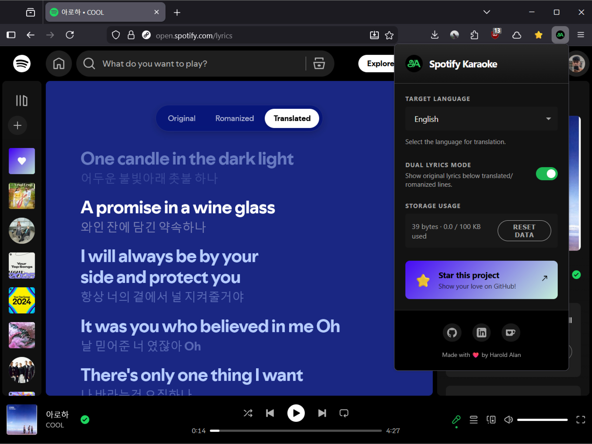
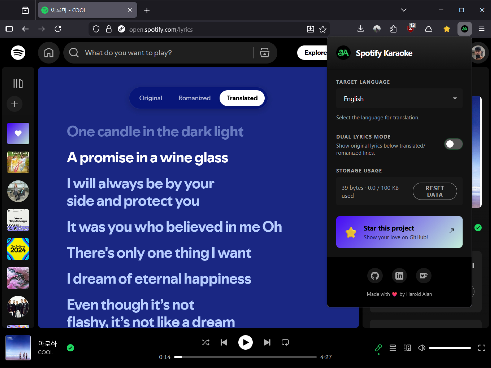
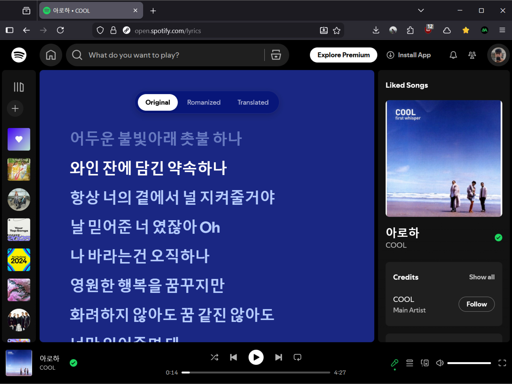
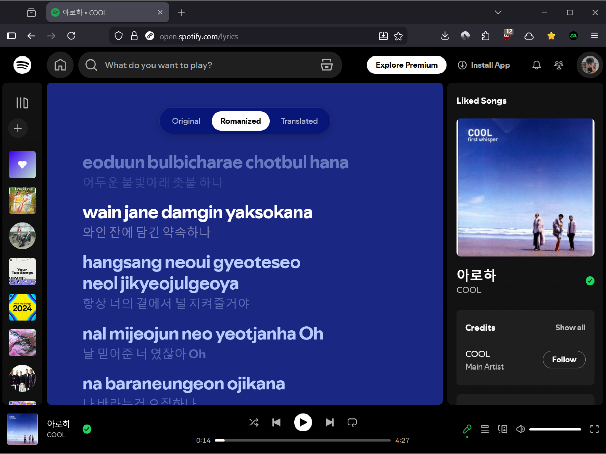
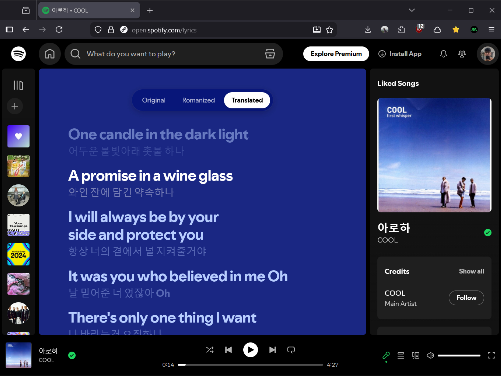
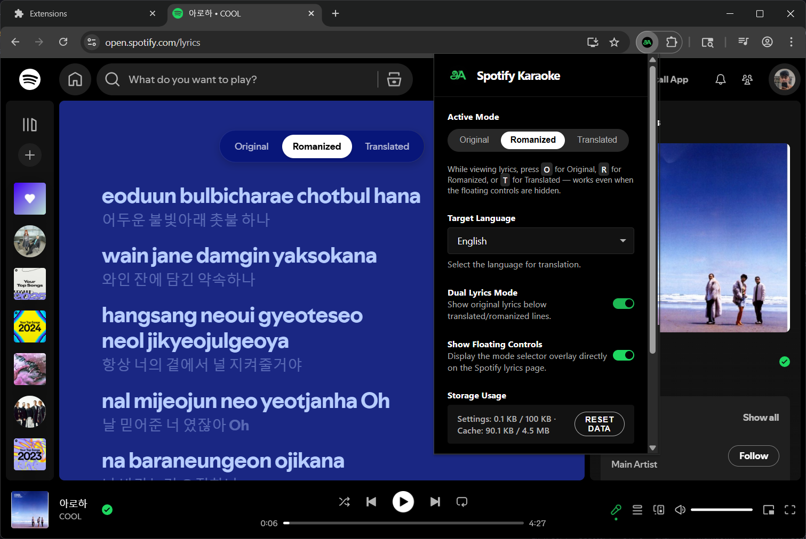
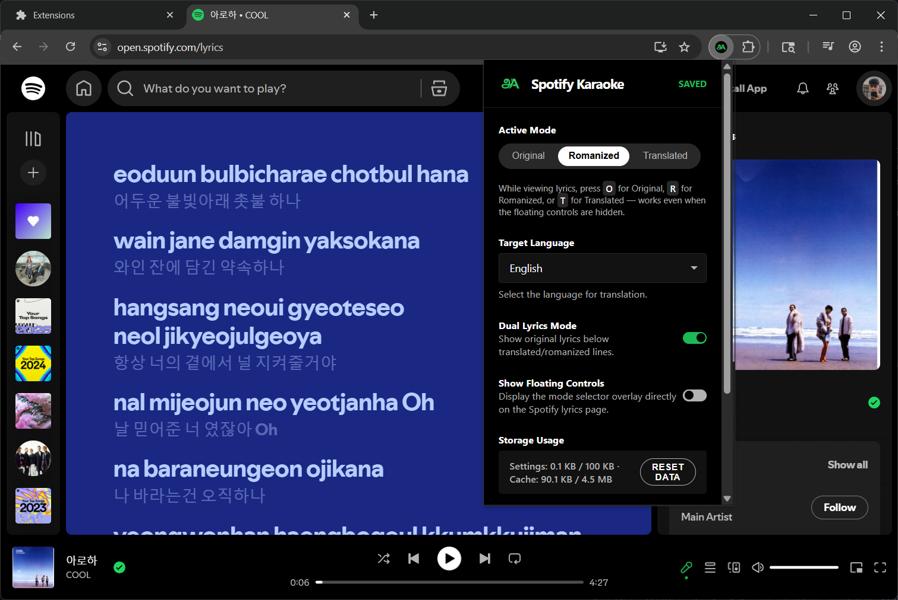

<div align="center">
  
  <h1>Spotify Karaoke</h1>
  <p>Sing along to any Spotify song — karaoke-style, with synchronized romanization and translation</p>

  <a href="https://chromewebstore.google.com/detail/spotify-karaoke/bhhkohameknlmcgdfafkjplpjalfedie"></a>
  <a href="https://addons.mozilla.org/en-US/firefox/addon/spotify-karaoke/"></a>
  <br><br>
  
  
  
</div>

---

## What it does

Spotify's built-in lyrics panel doesn't help you sing along to songs in languages you don't read. `Spotify Karaoke` fixes that. It adds three lyric display modes to the Spotify web player:

- **Original** - lyrics as Spotify shows them, unchanged.
- **Romanized** - non-Latin scripts (Japanese, Korean, Tamil, Hindi, etc.) rendered phonetically in the Latin alphabet so you can sing along.
- **Translated** - lyrics translated into any of 100+ languages.

Switch between modes using the floating pill controls injected directly into the lyrics panel, the popup, or keyboard shortcuts. No page reload, no flicker.

**Native script restoration:** For Hindi, Tamil, Korean, and other non-Latin songs, Spotify often serves romanized fallback lyrics. This extension automatically replaces them with the correct native script — before Spotify even renders the page.

**Dual Lyrics mode** - in Romanized or Translated mode, the processed text becomes the primary karaoke highlight line, with the original script shown below in a smaller font for reference. Sing along phonetically in Romanized, or follow the meaning in Translated, while always keeping the original in view.

| Dual Lyrics On | Dual Lyrics Off |
| :---: | :---: |
|  |  |

| Original (Korean) | Romanized |
| :---: | :---: |
|  |  |

| Translated |
| :---: |
|  |

---

## Controls

There are three ways to switch between Original, Romanized, and Translated:

| Method | How |
| :--- | :--- |
| **Floating pill** | The `[Original] [Romanized] [Translated]` pill injected at the top of the Spotify lyrics panel. |
| **Extension popup** | The same pill is replicated inside the popup - acts as a remote control and always reflects the current mode, even if the floating pill is hidden. |
| **Keyboard shortcuts** | While the lyrics panel is open, press `O` (Original), `R` (Romanized), or `T` (Translated). Safe to use - shortcuts are ignored when focus is in a text input or search bar. |

Power users can toggle off the floating pill entirely via **Show Floating Controls** in the popup, then use keyboard shortcuts or the popup pill for a completely unobstructed lyrics view.

| Floating Controls On | Floating Controls Off |
| :---: | :---: |
|  |  |


---

## Installation

**From the browser store (recommended):**
- [Chrome Web Store](https://chromewebstore.google.com/detail/spotify-karaoke/bhhkohameknlmcgdfafkjplpjalfedie) - Chrome, Edge, Brave, and other Chromium browsers
- [Firefox Add-ons](https://addons.mozilla.org/en-US/firefox/addon/spotify-karaoke/)

**Manual install (Developer Mode):**
1. Download the latest `.zip` from the [Releases page](../../releases) and extract it.
2. Open your browser's extensions page (`chrome://extensions` or `about:debugging`).
3. Enable **Developer Mode**, then click **Load unpacked** (Chrome) or **Load Temporary Add-on** (Firefox) and select the extracted folder.

---

## Native Script Restoration for Non-Latin Scripts

Spotify often serves romanized fallback lyrics for non-Latin songs (e.g. Thai, Arabic, or Indian languages) even when the original native-script version exists on Musixmatch.

Spotify Karaoke fixes this automatically. When you play a supported song, the extension intercepts Spotify's lyrics API response, detects the romanized fallback, fetches the native-script subtitles from Musixmatch, and replaces the response before Spotify renders it. The original script appears natively in the lyrics panel — no user action required.

Romanize and Translate modes then operate on the correct native source, producing significantly more accurate results.

**Supported languages:** All non-Latin scripts (Hindi, Tamil, Thai, Arabic, Telugu, Japanese, Korean, etc.).

---

## Romanization Coverage

| Script | Library | Processing |
| :--- | :--- | :--- |
| **Japanese** (Kanji + Kana) | `@sglkc/kuroshiro` + Kuromoji | Local |
| **Korean** (Hangul) | `@romanize/korean` | Local |
| **Chinese** (Hanzi) | `pinyin-pro` | Local |
| **Tamil** | `tamil-romanizer` | Local |
| **Indic** (Devanagari, Telugu, Gujarati, Gurmukhi, Kannada, Odia) | `@indic-transliteration/sanscript` | Local |
| **Cyrillic** (Russian, Ukrainian, etc.) | `cyrillic-to-translit-js` | Local |
| **Thai** | `@dehoist/romanize-thai` | Local |
| **Malayalam, Bengali, Arabic, Hebrew** | Google Translate (`dt=rm`) | API |
| **Any script** *(Fallback)* | `transliteration` | Local |
| **Translation** (All scripts) | Google Translate → MyMemory fallback | API |

---

## Under the Hood

| | |
|---|---|
| **Interception point** | `document_start`, MAIN world — before React first paint |
| **Romanization** | 9 local libraries · zero API calls for JP/KO/ZH/Indic/Cyrillic/Thai/Tamil |
| **Stale-cancel guards** | 2 independent generation counters (`_currentInterceptGeneration` in interceptor · `processGen` in content script) |
| **Translation fallback** | Google Translate → MyMemory → original preserved |
| **Cache** | 10-song in-memory LRU + 4.5 MB persistent LRU (`browser.storage.local`, evicts to 3.5 MB) |
| **Browser support** | Chrome MV3 · Firefox MV2 (≥ 142.0) |

---

## Developer Setup

**Requirements:** Node.js 18+

```bash
git clone https://github.com/haroldalan/spotify-karaoke.git
cd spotify-karaoke
npm install

npm run dev          # Chrome (live reload)
npm run dev:firefox  # Firefox (live reload)

npm run build          # Production build - Chrome
npm run build:firefox  # Production build - Firefox
npm run zip            # Package for Chrome Web Store submission
npm run zip:firefox    # Package for Firefox Add-ons submission

npm run test           # Run unit and component test suite
```

### Project Structure

```
entrypoints/
  background.ts              # Service worker: romanization + translation orchestration
  fetchInterceptor.ts        # MAIN world unlisted script: fetch interceptor, native script restoration
  spotify-lyrics.content/
    index.ts                 # DOM engine: MutationObserver, mode switching, caching
    style.css
  popup/                     # Preact popup: mode pill, language selector, dual lyrics + visibility toggles
```

### How it works

Spotify Karaoke uses an injected DOM engine and a service worker to process lyrics in real-time.

<details>
<summary>Technical deep-dive</summary>

**Lyrics injection:** A `MutationObserver` watches Spotify's `<main>` element for newly rendered lyric lines. When the lyrics change, the engine reads the current mode (Original / Romanized / Translated), fetches processed lyrics from cache or sends a `PROCESS` message to the background worker, and writes the result back into the existing DOM elements. Spotify's own React state is never touched.

**Romanization & translation:** The background service worker receives an array of lyric strings, detects the script using Unicode range scoring, routes to the appropriate local library or Google Translate batch API, and returns both a translated array and a romanized array in a single response.

**Native script restoration:** `entrypoints/fetchInterceptor.ts` is compiled as an unlisted script and registered in the extension manifest to run in the `MAIN` world at `document_start`. This ensures the interceptor is active before Spotify's application bundle even begins to execute, solving previous race conditions. It monkey-patches `window.fetch` to intercept `color-lyrics/v2/track/*` responses.
</details>

---

## Contributing

1. Fork the repository.
2. Create a feature branch: `git checkout -b feature/your-feature`
3. Commit your changes: `git commit -m 'feat: describe what you added'`
4. Push and open a Pull Request.

Please keep PRs focused. One feature or fix per PR makes review much faster.

---

## Privacy & Disclaimer

- **Privacy:** No personal data is collected. Your settings (language preference, mode, UI preferences) are stored in `browser.storage.sync` and mirrored in `localStorage` for zero-latency UI hydration. Processed lyrics (romanized/translated text) are cached locally in `browser.storage.local` with an **unlimited quota** (and LRU eviction) to avoid redundant API calls. Lyric text is sent to Google Translate or MyMemory when using Translated or API-based Romanized modes. See [Google's Privacy Policy](https://policies.google.com/privacy) and [MyMemory's Terms](https://mymemory.translated.net/doc/tos.php).
- **Disclaimer:** Spotify Karaoke is not affiliated with or endorsed by Spotify AB. It is an independent open-source project that modifies the Spotify web player UI for personal and accessibility use.

---

<div align="center">
  MIT License · <a href="https://ko-fi.com/haroldalan"></a><br>
  <i>Made by Harold Alan. If you find it useful, a ⭐ on GitHub goes a long way.</i>
</div>
